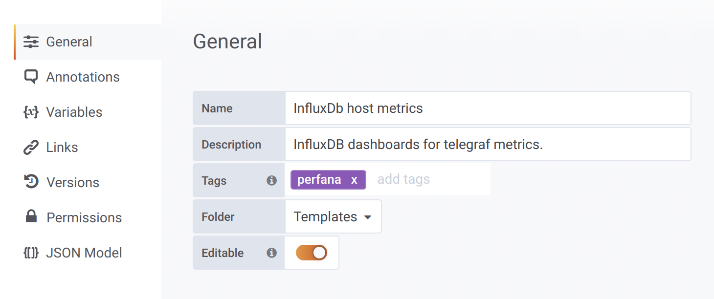

# Administration
{: .no_toc }

## Table of contents
{: .no_toc .text-delta }

1. TOC
{:toc}

---

> This page is work in progress!

{: .fs-6 }

## Grafana configuration

As an `admin` user you can maintain the Grafana configuration in Perfana. To do so open the `Grafana configuration` from the `Admin` section of the sidebar.

It is possible to add multiple Grafana instances, to add one click on the `Add Grafana instance` button, this will open the `Add Grafana instance` form with these fields:

* Label: add descriptve name for this Grafana instance
* Url to connect from client: The grafana url that your browser uses to connect to the Grafana instances
* Url to connect from server: *Optional* Url to connect to Grafana instance from Perfana server side. For instance the service name when both Perfana and Grafan are running in Kubernetes.
* Grafana Organisation ID
* Grafana API key: API key with admin role, see [Grafana documentation](https://grafana.com/docs/grafana/latest/http_api/auth/#create-api-token)
* Username: Username for Grafana admin user
* Password
* Use this Grafana instance to store all snapshots: if checked this Grafana instance will be used to store snapshots.
* Use this Grafana instance to host the Perfana dashboards: if checked, Perfana will use this instance for hosting Perfana dashboards for trends and profile check results.

The `Grafana configuration` view will show you one or more Grafana instances and for each dashboard the dashboards that have been registered in Perfana. To register a Grafana dashboard is Perfana is simple: just add a `perfana` tag to the dashboard:

The `grafana-perfana` service will now automatically register the dashboard in Perfana and will update it when changes are made. If the dashboard is deleted from Grafana by mistake, the `grafana-perfana` will restore it. 

> If you use the `delete` icon in the `Linked dashboards` section, the dashboard will be deleted in both Perfana and Grafana!

## Teams configuration

Perfana allows admin users to create `Teams` to efficiently organise the test run data. `Teams` consist of one or more `team members` and a `system under test` is linked to one `team`.

To mantain the configured `Teams` an `admin` user can open the `Teams` item from the `Admin` section of the sidebar.

A new `Team` can be added by clicking the `Add team` button, this will open the `Add team` from with these fields:

* Organisation: select Organisation
* Name
* Description

Click the `team` row to view the team members and the systems under test linked to this team.

A team has one or more `team members` and `users` can be member of one or more `teams`. To add `team members` click on the select box to select one or more users.

A `team` can be responsible for one or more `systems under test`, but a `system under test` is linked to one `team` only. To link `system under tests` to the selected team, select one or more via the select box.

> When you link a `system under test` to a `team` that was already linked to another team, it will no longer be linked to the other team!

## Profiles configuration

## Data retention and test run expiry

## Quality gate

## Settings

